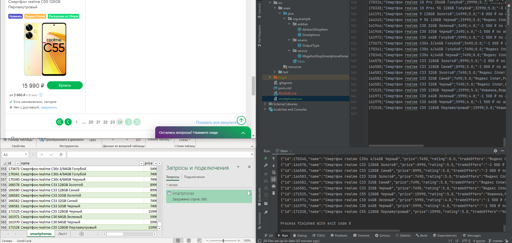

# Megaphone Shop Parses

## Функционал

Приложение последовательно считывае информацию о всех смартфонах с сайта https://moscow.shop.megafon.ru и переводит их в выбранный формат вывода (JSON для консоли, CSV для файл).  
В приложении используется Silenium, для того чтобы считывать html, который был динамически добавлен при помощи JS, так как сама по себе библиотека JSOUP запрашивает html до выполнения скриптов и не дает получить информацию о персональных предложениях.  
При работе приложения Silenium открывает отдельное окно с браузером Chrome (должен быть установлен) и автоматически переключается между страницами смартфонов.  

Приложение собирает информацию о 5 параметрах:  
1. ID - для индентификации товара
2. Название смартфона - для упрощенной идентификации товара человеком
3. Цена - то, на что покупатели с набольшей вероятностью обратят внимание
4. Рейтинг - покупатели избегают товаров с плохими отзывами
5. Особые предложения - могут подтолкнуть покупателя к совершению сделки именно с тем, чьи предложения наиболее выгодные

Аналитики по этим параметрам могут оптимизировать собственные торговые предложения.

## Использование

1. Клонировать репозиторий
2. Открыть приложение через `IntelliJ Idea`
3. Установите `JDK 17` в качестве JDK
4. Включите `Annotation Processing`
5. Запустить приложение и ввести запрашиваемые параметры в консоль  

Спустя некоторые время в зависимости от выбранной опции информация будет появляться в файле/консоли.

Результат работы по анализу всех смартфонов с сайта (565 смартфонов + шапка таблицы)  

Автор: Шевцов Ярослав